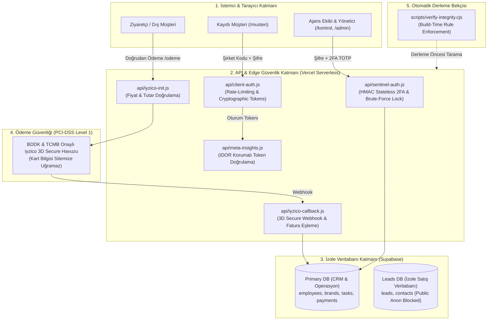

# 🛡️ SocialArt Ajans — Kapsamlı Güvenlik Mimarisi Haritası (Security Blueprint)

> **Belge Amacı:** Bu doküman, SocialArt Ajans web platformunun mevcut tüm güvenlik katmanlarını, veri koruma mekanizmalarını, yetkilendirme modellerini ve sınırlarını A'dan Z'ye açıklar. Bu platform üzerinde geliştirme yapacak yapay zekalar ve mühendisler için **bağlayıcı teknik referans** niteliğindedir.

---

## 1. Mimari Genel Bakış & Güvenlik Diyagramı

Sistem, **Savunma Derinliği (Defense in Depth)** ve **Sıfır Güven (Zero-Trust)** ilkelerine dayalı 6 ana güvenlik katmanından oluşur:

---

## 2. Güvenlik Katmanlarının Detaylı Analizi

### KATMAN 1: Yönetici & Ekip Kimlik Doğrulaması (`/kontrol` - Sentinel Auth)
* **İki Aşamalı Güvenlik (2FA):**  
  1. Aşama: Kullanıcı adı ve güçlü parola kontrolü.  
  2. Aşama: RFC 6238 standardında Google Authenticator zaman tabanlı tek kullanımlık kod (TOTP).
* **Kullanıcı Başına İzole TOTP Anahtarları:**  
  * Furkan, Ercan ve Celal hesaplarının her birinin 2FA anahtarı birbirinden tamamen bağımsızdır.
  * Bir kullanıcının kodu veya anahtarı diğer bir kullanıcının hesabını açamaz.
* **Durumsuzluk (Stateless Serverless) Mimarisi:**  
  * Vercel sunucusuz lambdalarında bellek içi `Map` kullanılmaz.
  * Oturumlar sunucuda tutulan gizli anahtarla **HMAC-SHA256** imzalı güvenli biletlerle (`signTempTicket` / `signSessionToken`) taşınır.
* **Zaman Kayması Toleransı (Clock Drift):**  
  * Saat farklarından dolayı kod reddedilmesini önlemek için `±60 saniye (±2 adım)` dinamik zaman toleransı uygulanır.
* **Kaba Kuvvet (Brute-Force) Koruması:**  
  * 5 başarısız deneme yapan IP adresi 15 dakika boyunca kilitlenir.

---

### KATMAN 2: Müşteri Paneli Giriş Güvenliği (`/musteri` - Client Auth)
* **Sunucu Taraflı Doğrulama (`/api/client-auth`):**  
  * Müşteri şifreleri istemci JavaScript kodlarına **asla gömülmez**.
  * Şifre kontrolü yalnızca sunucu tarafında yapılır.
* **Şifre Arındırma (Sanitization):**  
  * Başarılı girişte tarayıcıya şifre yerine kriptografik geçici bir oturum token'ı (`portal_tok_<random_hex>_<timestamp>`) verilir.
* **IP Kilitleme:**  
  * Müşteri girişinde 5 hatalı denemede IP bazlı 15 dakikalık kilit devreye girer.

---

### KATMAN 3: Dinamik Rol ve Yetkilendirme Modeli (RBAC)
* **Katmanlı Yetki Çözümleme (`resolveEffectivePermissions`):**  
  Yetki kontrolü tek bir statik booleana bağlanamaz. Sistem 3 seviyeli bir öncelik sırasıyla yetkileri hesaplar:
  1. **Rol Paketi Şablonu (`rolePackageId`):** *Kreatif Direktör, Operasyon Yönetimi, Strateji vb.*
  2. **Bireysel Yetki Ezmeleri (`permissionOverrides`):** Çalışana özel açılan/kapatılan izinler (`calendar.view`, `tasks.assign`, `finance.manage` vb.).
  3. **Modül Korumaları:** Finans ve muhasebe gibi kritik alanlar ekstra güvenlik kilidine (`socialart_finance_emergency_lock`) tabidir.

---

### KATMAN 4: Veritabanı ve Veri İzolasyonu (Supabase)
* **Çift Veritabanı Ayrımı:**  
  1. **Primary Database (`osuwytugjscwhcxxkhfa`):** Ajans operasyonel verileri (`employees`, `brands`, `tasks`, `payment_requests`, `client_support_messages`).
     * `employees` tablosunda TC Kimlik, maaş, şifre veya 2FA gizli anahtarları **bulunmaz**.
  2. **Leads Database (`piffaggeshfrubyjkhej`):** Web sitesinden gelen potansiyel müşteri formları ve CRM kayıtları.
     * Web sitesindeki anonim API anahtarı (`ANON_KEY`) ile bu veritabanına erişim **fiziksel olarak engellenmiştir** (`Invalid API key / Access Denied`).
* **Veritabanı Şema Bütünlüğü:**  
  * Tabloda olmayan (`paid_at` vb.) hiçbir alan kod tarafından update/insert edilemez; tüm işlemler şemayla %100 eşleniktir.

---

### KATMAN 5: PCI-DSS Seviye 1 Ödeme Güvenliği (iyzico & Direkt Ödeme)
* **Sıfır Kart Verisi Teması (Zero-Knowledge Architecture):**  
  * Müşterinin 16 haneli kart numarası, son kullanma tarihi ve CVV güvenlik kodu sitemize veya sunucumuza **kesinlikle uğramaz.**
  * Kart girişi doğrudan BDDK ve TCMB onaylı iyzico güvenli iframe/script havuzunda yapılır.
* **Sunucu Taraflı Tutar Güvenliği (`/api/iyzico-init`):**  
  * İstemcinin tarayıcıdan tutarı manipüle etmesini önlemek için, talep ID'si (`requestId`) gönderildiğinde gerçek tutar doğrudan veritabanından (`total_amount` / KDV dahil) teyit edilir.
* **3D Secure Webhook Eşleme (`/api/iyzico-callback`):**  
  * İyzico ödemeyi onayladığında dönen `conversationId` üzerinden sipariş/fatura ID'si ayrıştırılır ve yalnızca eşleşen fatura **"🟢 ÖDENDİ"** durumuna getirilir.

---

### KATMAN 6: Otomatik Derleme Bekçisi (Automated Build-Time Gatekeeper)
* Projede [`scripts/verify-integrity.cjs`](file:///C:/Users/Arda%20Furkan%20Aslanba%C5%9F/.gemini/antigravity/scratch/socialart-ajans/scripts/verify-integrity.cjs) scripti `build-all` derleme hattının 0. adımıdır:
  1. Veritabanına olmayan sütun gönderilmiş mi?
  2. Modal menülerinde z-index (`z-[99999]`) hatası var mı?
  3. Serverless fonksiyonlarda bellek içi oturum değişkeni unutulmuş mu?
  * **Kural ihlali varsa build durdurulur; hatalı kodun yayına gitmesine fiziksel olarak izin verilmez.**

---

## 3. Gelecekte Geliştirme Yapacak Yapay Zekalar / Mühendisler İçin Kesin Kurallar (DO's & DON'Ts)

| Kategori | ❌ KESİNLİKLE YAPILMAYACAKLAR (DON'T) | ✅ ZORUNLU UYGULANACAKLAR (DO) |
| :--- | :--- | :--- |
| **Kimlik Doğrulama** | `/api/` içinde `const sessions = new Map()` veya global oturum değişkeni tanımlamak. | Her zaman HMAC imzalı stateless token (`signSessionToken`) kullanmak. |
| **Veritabanı** | Supabase Postgres tablolarına doğrulanmamış sütun (`paid_at`, `temp_code` vb.) göndermek. | Tablo şemasını kontrol edip yalnızca var olan sütunları güncellemek. |
| **Ödeme İşlemleri** | Kredi kartı formunu kendi HTML/React inputlarımızla toplamak. | Kart işlemlerini her zaman iyzico iframe/modal havuzuna bırakmak. |
| **Yetkilendirme** | Menü/sayfa erişimini tek bir `user.isAdmin` veya `hasCalendarAccess` gibi statik bayrağa bağlamak. | `resolveEffectivePermissions` fonksiyonuyla dinamik izinleri taramak. |
| **UI Modallar** | Radix UI açılır menülerini varsayılan `z-50` katmanında bırakmak. | `SelectContent` ve `PopoverContent` için her zaman `z-[99999]` katmanını uygulamak. |
| **Derleme** | Yapılan değişiklik sonrası `node scripts/build-all.cjs` çalıştırmadan kodu pushlamak. | Otomatik bütünlük kontrolünü (`verify-integrity`) geçerek 0 hata ile derlemek. |

---

## 4. Potansiyel Geliştirme ve İleri Seviye Güvenlik Önerileri (Future Enhancements)

Bu haritayı inceleyecek bir yapay zekanın veya siber güvenlik uzmanının değerlendirebileceği **bir sonraki seviye güvenlik adımları**:

1. **Supabase RLS (Row Level Security) Politikalarının Sıkılaştırılması:**  
   * `payment_requests` ve `client_support_messages` tablolarına yalnızca ilgili `company_code` oturumuna sahip kişilerin erişebilmesi için PostgreSQL RLS politikalarının devreye alınması.
2. **Kritik İşlem SMS OTP Doğrulaması:**  
   * Şirket içi büyük bütçeli para çıkışlarında veya personel silme işlemlerinde Google 2FA'ya ek olarak yönetici telefonuna SMS onay kodu gönderilmesi.
3. **Cloudflare WAF (Web Application Firewall) & DDoS Koruması:**  
   * `socialartmedya.com` DNS'inin Cloudflare arkasına alınarak Bot Koruması, Rate-Limiting ve Geo-IP filtreleme uygulanması.
