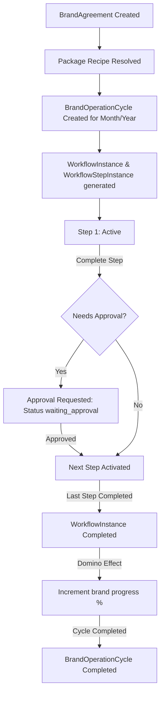

# SocialArt CRM/ERP (social-art-base) Architecture & Implementation Guide

This document provides a comprehensive technical overview of the Next.js CRM panel codebase (`social-art-base`) located in the `/panel` directory. It is designed to act as an instant context loader for AI agents and human developers, minimizing token consumption and accelerating understanding of the codebase structure.

---

## 1. Technical Stack & Build Strategy

*   **Core Framework**: Next.js 14.2 (App Router) using TypeScript.
*   **Database & Auth**: Supabase JS Client SDK.
*   **Styling**: TailwindCSS & Radix UI (Shadcn templates).
*   **Deployment Configuration**: Built using **Static HTML Export (`output: 'export'`)** inside Vercel.
*   **Subpath Hosting**: Hosted under `/admin` of the main domain using `basePath: '/admin'` in `next.config.js`.
*   **Build Pipeline (`/scripts/build-all.cjs`)**:
    1. Loads environmental variables from both root `.env` and `panel/.env.local`.
    2. Installs dependencies inside `/panel`.
    3. Statically compiles Next.js project into `/panel/out/`.
    4. Copies `/panel/out/` into `/public/admin/` of the Vite SPA.
    5. Compiles the root Vite project. Vercel serves the panel pages directly as static HTML assets.

---

## 2. Directory Mappings

```
/panel
├── app/                      # Next.js App Router (Page wrappers, Server Components)
│   ├── [route]/page.tsx      # Main path components (approvals, calendar, dashboard, etc.)
│   └── [route]/[id]/page.tsx # Dynamic path wrappers containing generateStaticParams() for static builds
├── components/               # Shareable Layouts, Guards, and UI Elements
│   ├── layout/               # Workspace sidebar layouts populated based on rolePackageId
│   └── shared/               # Access denied guards, task modals, badges
├── config/                   # System-wide static rules and configurations
│   ├── permissions.ts        # Hieararchical permission keys and resolveEffectivePermissions()
│   └── modules.ts            # Sidebar menus mapped to specific Role Packages
├── features/                 # Modular domain folders containing components, hooks, schemas, seeds
│   ├── approvals/            # Internal & external approval dialogs and lists
│   ├── brands/               # Brand creation, tracking tables, package previews, assignment forms
│   ├── dashboard/            # Dynamic metrics cards and statistics charts per role
│   ├── employees/            # Employee lifecycle, edit pages, workload metrics, offboarding sihirbazı
│   ├── my-work/              # The taskboard (Benim İşlerim) for active tasks, pending and completed tabs
│   ├── notifications/        # Message grids and read status toggles
│   ├── operations/           # Dynamic schedules and timeline rule definitions
│   └── workflows/            # Brand workflows, history logs, accordion steps
├── lib/                      # Pure business logic engines and database access layers
│   ├── kpi/                  # KPI performance calculations and label definitions
│   ├── operations/           # Cycle creators and scheduled date calculators
│   ├── repositories/         # Supabase client-side SQL abstraction wrapper layer
│   ├── storage/              # Bridging layer for retro-compatibility (wrapping repositories in promise APIs)
│   └── workflows/            # State transitions, DOMINO and CYCLE triggers, image upload handlers
├── types/                    # TypeScript interfaces
│   └── domain.ts             # Contains the complete database structure & dropdown labels
└── tsconfig.json             # TS compiler configuration
```

---

## 3. Database & Abstraction Layer (`lib/repositories` & `lib/storage`)

To allow instant swaps between different storage backends (e.g., local storage during testing and Supabase in production), the data access uses a **Repository Pattern**.

*   **Database Engine**: Supabase acts as the remote database.
*   **Storage Bridges (`lib/storage/local-*.ts`)**: Original local storage getters/setters rewritten as async promises wrapping repository calls. If a developer uses a storage method, it transparently talks to the Supabase client.
*   **Supabase Schema (`supabase_schema.sql`)**: Contains PostgreSQL DDL schemas for all tables: `employees`, `brands`, `ideas`, `cycles`, `workflow_instances`, `workflow_step_instances`, `workflow_history`, `workflow_handoffs`, `notifications`, `workflow_approvals`, `calendar_events`, `reports`.
*   **Supabase Migration helper (`lib/supabase/migration.ts`)**: System Settings page includes a migration trigger to dump historical browser localStorage data directly into Supabase tables during setup.

---

## 4. Role & Permission Engine (`config/permissions.ts`)

The panel enforces page-level and action-level authorization through a hierarchical permission model:

*   **Role Packages (`RolePackageId`)**: Pre-defined job profiles (e.g., `operasyon-yonetimi`, `grafik-tasarim`, `video-kurgu`).
*   **Effective Permissions Resolving**: `resolveEffectivePermissions` calculates a user's rights by merging:
    1.  Default permissions attached to their `RolePackageId`.
    2.  Implicit permissions gained from their Team memberships (`teamIds`).
    3.  Manual permission overrides (`permissionOverrides` JSON) configured in the Employee Edit page.
*   **Route Guards**: If a user lacks the required permission key (e.g., `team.manage` for `/employees`), the `<AccessDenied />` layout halts execution.

---

## 5. Workflow Runtime Engine (`lib/workflows`)

This is the core business logic governing content creation stages (e.g., Briefing $\rightarrow$ Shooting $\rightarrow$ Editing $\rightarrow$ Finalizing).



### Key Logic Elements:
*   **Dynamic Package Recipes (`package-seeds.ts`)**: Instead of plain lists, client packages (e.g., Booster, Eko) map to recipes specifying `Operation Template ID` + `Target Quantity` relations.
*   **Workflow Step Generation**: Generating a cycle reads package recipes, resolves templates, and instantiates the workflow chains for that specific month.
*   **Domino Effect**: Completing all steps in a `WorkflowInstance` increments the "Gerçekleşen Adet" of the corresponding `OperationPlanItem`. When the target is met, it updates the plan item status to `completed`.
*   **Cycle Completion**: Once all non-cancelled plan items are completed, the overall monthly cycle status transitions to `completed`.
*   **Audit logs (`WorkflowHistory`)**: Every state transition (assigning, completing, approving, handoffs) appends a history block recording user ID, timestamp, old state, and new state.

---

## 6. Sorumluluk Atama & Handoff (Paslama) System

*   **Akıllı Eşleştirme (Auto-Assign)**: When a workflow step is activated, the engine queries the `Brand.brandAssignments` list. It matches the step's `responsibilityRole` against the assignee's responsibility text using case-insensitive, fuzzy string evaluation.
*   **Unassigned Fallback**: If no team member matches, the task goes into the "Ortak Havuz" (unassigned).
*   **Handoff Process (`handoff-workflow.ts`)**:
    *   A worker can delegate their active task to another employee by clicking "Pasla" (requires a reason & note).
    *   The task state becomes `pending_handoff`, freezing completion and approval buttons.
    *   The target employee receives a notification and sees the task in their "Bana Paslananlar" tab.
    *   If **Accepted**, the assignee field updates to the target employee. If **Rejected**, responsibility reverts back.

---

## 7. Approval Center & Notification System

*   **Multi-Stage Approvals (`approval-workflow.ts`)**:
    *   Steps with `requiresApproval = true` require clicking "Onaya Gönder" instead of "Tamamla".
    *   This transitions the step status to `waiting_approval`.
    *   Internal manager roles (`operasyon-yonetimi`) see these inside their `/approvals` center. Client-side approvals are simulated via client-review status blocks.
    *   Managers can **Approve** (advancing the step), **Reject**, or **Request Revision** (re-activating the task for the assignee, requiring revision notes).
*   **Event-Driven Notifications**: State hooks (`onStepActivated`, `onHandoffRequested`, `onApprovalApproved`, etc.) automatically generate namespaced inbox items inside `/notifications` for target users. Reading notifications redirects users straight to `/my-work` or `/brands/[id]` details.

---

## 8. KPI & Metrics Engine (`lib/kpi`)

Calculates operational metrics shown on the dashboard:
*   **Workload Score**: Counts active tasks weighted by template complexity.
*   **Performance Metrics**: Evaluates completion speeds against target dates (relative, monthly week, fixed day timelines).
*   **circular Progress Calculation**: Real-time completion rates calculated dynamically by comparing target vs. completed items in active cycles.

---

## 9. Dynamic Workspace Sidebar (`components/layout/workspace-layout.tsx`)

*   The navigation panel is fully responsive and adjusts dynamically based on the logged-in employee's `rolePackageId`.
*   Rather than hardcoding links, it evaluates `config/modules.ts` configuration rules. Designers see designer-specific modules; editors see editor-specific modules.
*   Non-implemented features present a sleek info toast (`toast.info`) ensuring a premium user experience during development.
